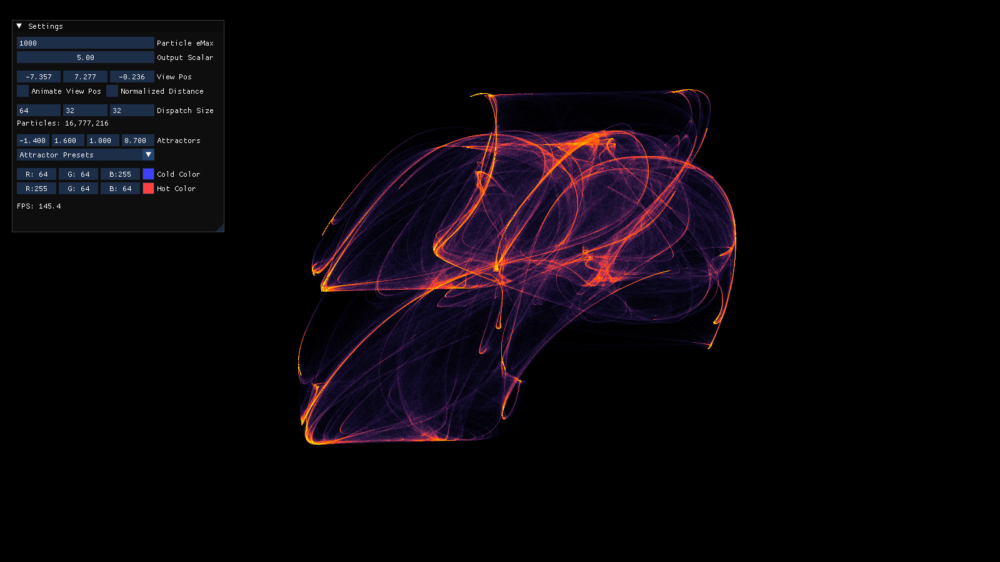

# SomeParticles

An additive particle system using a modified Clifford Attractor, made with OpenGL and compute shaders to run on the GPU



See more screenshots in the `Screenshots` directory.


## Technical Details

Uses OpenGL 4.60 with the `ARB_gpu_shader_int64` and `NV_shader_atomic_int64` extensions.

Each particle first chooses a random location inside a unit cube, then follows the attractor's rules. The current version plots each particle as a white pixel, storing that color in the pixel buffer after projecting it onto screen coordinates.

Pixel colors are stored in a R21G22B21 formatted uint64 SSBO, similar to [Mike Turitzin's implementation](https://miketuritzin.com/post/rendering-particles-with-compute-shaders/). It uses atomicAdd to add packed int64s together. When the eMax is sufficiently high enough, there is very little overflow.

The output fragment shader then unpacks the (white) color and then lerps between the hot and cold color uniforms based on the unpacked color, which is a function of the number of particles on a pixel.

Shaders are embedded on a Release build, using a custom CMake command and utility program to embed files as C hex arrays. Otherwise, the working directory of the debug application should be the source folder `SomeParticles/SomeParticles/` so the shaders can be found.

V-Sync is on by default. Define NO_VSYNC in the compile options to turn it off.


## Building

Use CMake (potentially in your favourite IDE) to build. It relies on GLFW and GLM libraries being installed, so this may be harder on Windows than it is on Linux.

You may need to add the paths manually or use `vcpkg`. 

To build a Release build (which also embeds shaders), use the following commands: 
```
cmake -B build -DCMAKE_BUILD_TYPE=Release
cmake --build build --config Release
```


## Usage

Adjust the dispatch size to control how many particles are calculated. There are no limits except those of your GPU

The more particles overlaid with another, the "hotter" the pixel gets. Adjust the `Particle eMax` to prevent overflow

Change the attractors to create new shapes or select one from the presets. If the attractor values provided are stable, then a.

Move the camera automatically with the `Animate View Pos` checkbox. If you don't like the fly-through, you can use the `Normalized Distance` checkbox. 

Toggle the ImGui Settings window with the `F1` key.